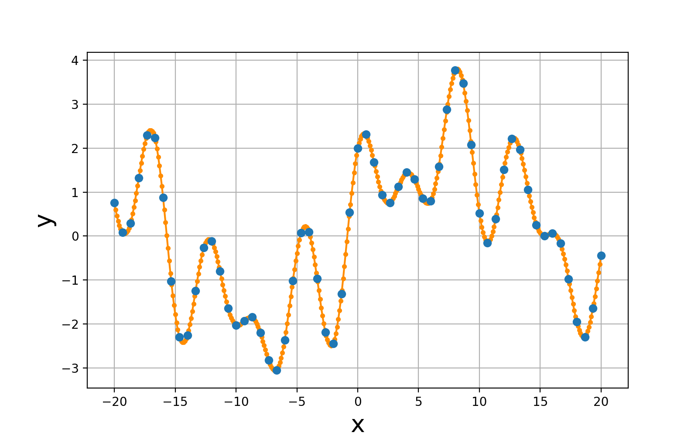

## curve_interp

Localized polynomial interpolation on a set of points drawn from an underlying a smooth function

Nicholas Kern
<br>
January, 2017



### Install
Clone this directory and run the setup.py script
```bash
python setup.py install
```

